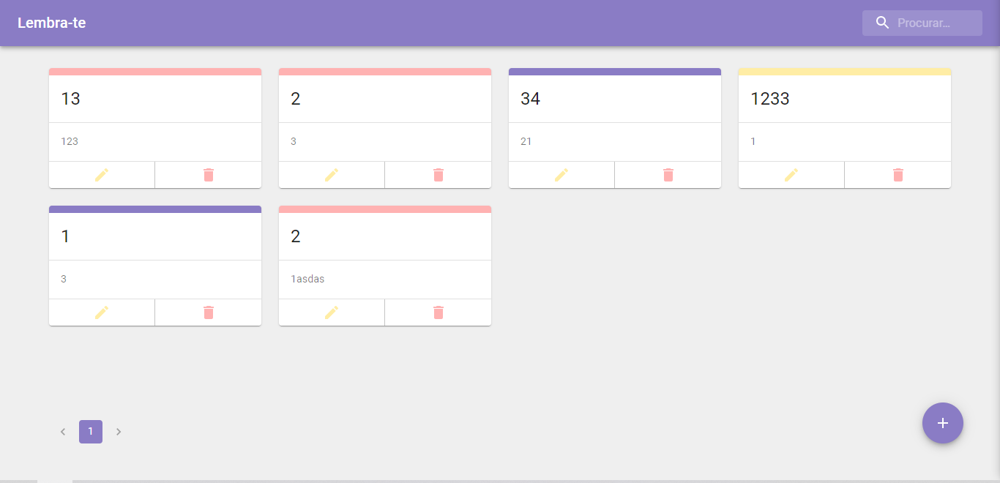

# Lembrate-te

Desenvolvido em [ReactJS](https://pt-br.reactjs.org/) com [MaterialUI](http://material-ui.com/)



## Instalação

Abra o terminal e clone o repositório com o comando abaixo:

```bash
git clone https://github.com/dougcarvalho92/lembrete.git
```
Execute o comando abaixo para baixar as dependencias do projeto.
```bash
yarn
```
Execute o comando abaixo para iniciar o servidor de desenvolvimento.
```bash
tw-dev-server
```
Execute o comando abaixo para iniciar o projeto
```bash
yarn start
```

## License
[MIT](https://choosealicense.com/licenses/mit/)